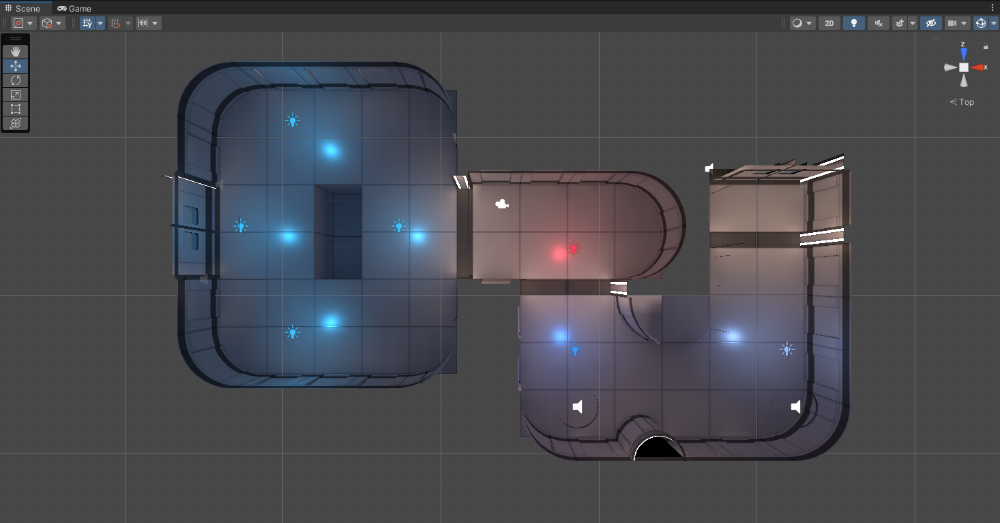
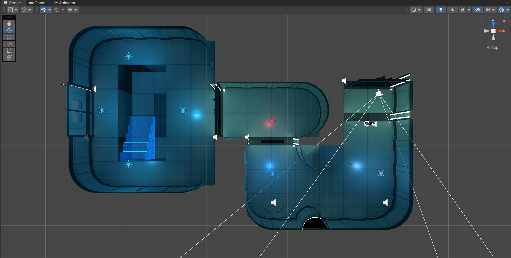
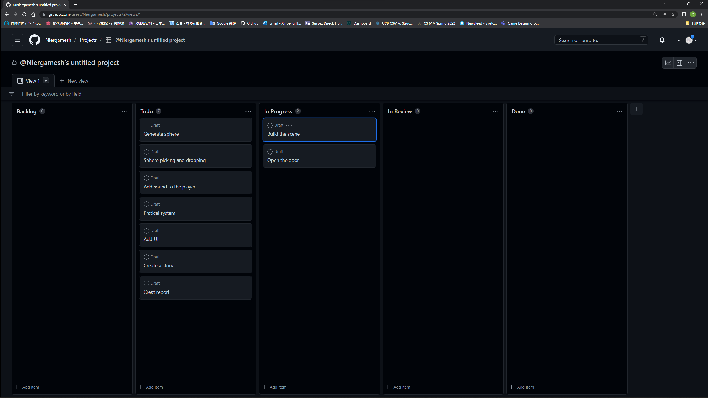
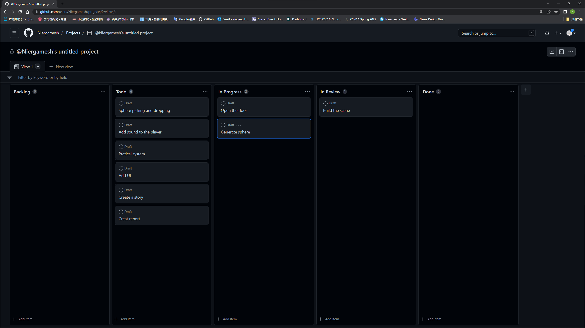
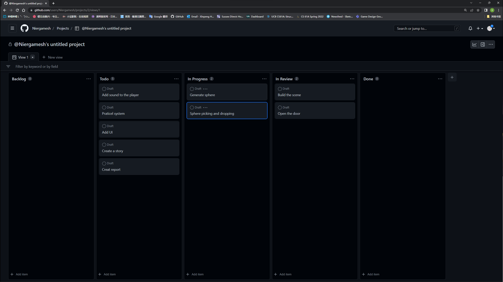
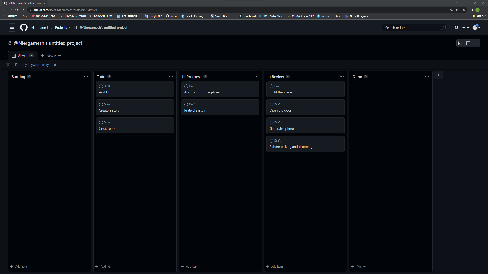
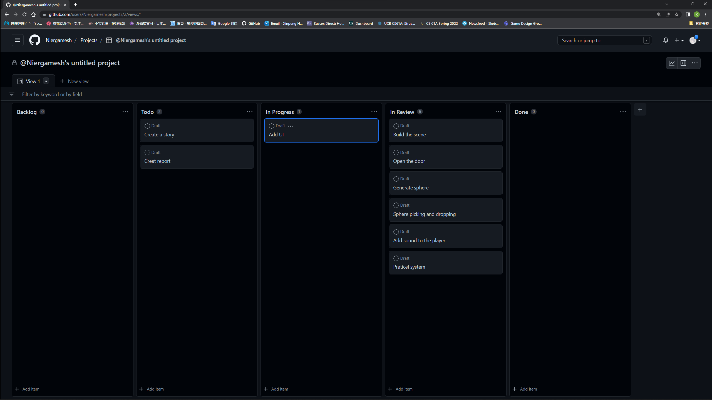
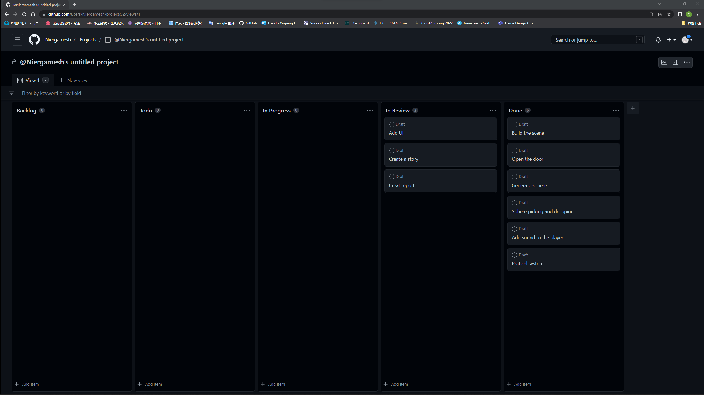

# Report

This is the report of 'Programing for 3D'

---
## Introduction
My scene has a sci-fi landscape.I downloaded the material of the scene（Figure 1） and the character controller from Unity's asset story, and then made some modifications to the scene（Figure 2）, adding some animation and audio for opening the door.

_Figure 1: Initial Scene

_Figure 2: After the change

Players will play an AI working in the building, their purpose is to throw the ball into the pit in the final room. When the number of balls in the pit reaches a certain amount, the game will win
## Project Plan
Below is a screenshot of the weekly schedule

_Figure 1: Week 1

_Figure 1: Week 2

_Figure 1: Week 3

_Figure 1: Week 5

_Figure 1: Week 7

_Figure 1: Week 8

_Figure 1: Week 9

## Design
## Technical Element
## Script
## Unique Element
## Summary
My scene demonstrates all the basic elements introduced throughout the lab, such as lighting, materials and textures, 3D physics, modeling, scripting, animation, sound and particle systems. Also added a scoring system and UI to make it look more like a game. When the ball is thrown into the pit, the count will increase by 1. When the count reaches a certain value, the game will end.
## Future Work
## Appendix
## References
Below are all references used in my application and report.
### GitHub
### Asset References
[Ultimate 10+ Shaders](https://assetstore.unity.com/packages/vfx/shaders/ultimate-10-shaders-168611)

[Starter Assets - Third Person Character Controller](https://assetstore.unity.com/packages/essentials/starter-assets-third-person-character-controller-196526)

[3D Free Modular Kit](https://assetstore.unity.com/packages/3d/environments/3d-free-modular-kit-85732)
### Report References
https://github.com/glowkeeper/Programmingfor3D/blob/main/docs/assignment/reportTemplate.md
