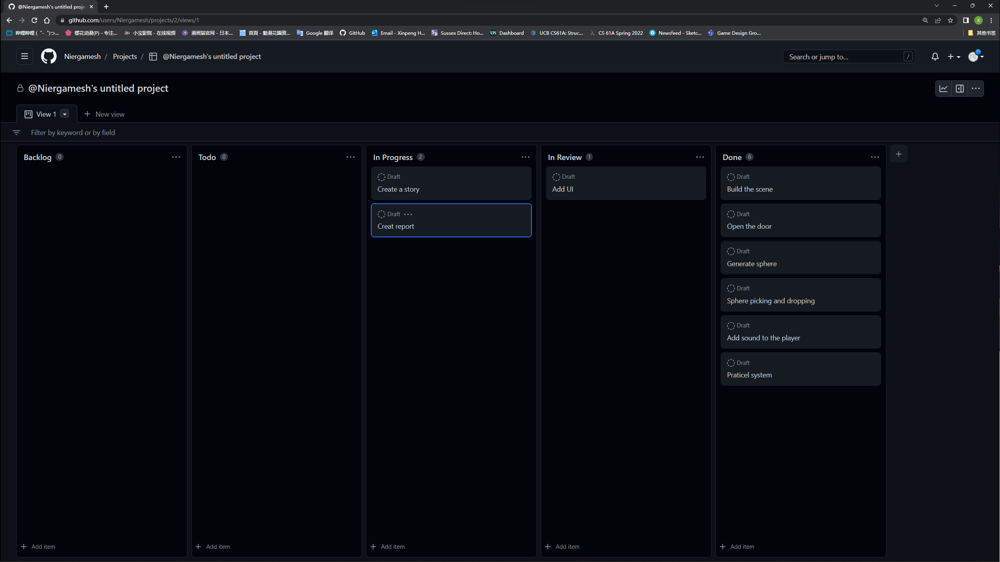

# Report

This is the report of 'Programing for 3D'

---
## Introduction
My scene has a sci-fi landscape.I downloaded the material of the scene and the character controller from Unity's asset story, and then made some modifications to the scene, adding some animation and audio for opening the door.

Players will play an AI working in the building, their purpose is to throw the ball into the pit in the final room. When the number of balls in the pit reaches a certain amount, the game will win.

## Project Plan
Below is a screenshot of the weekly schedule


_Figure 1: Week 1


_Figure 1: Week 2


_Figure 1: Week 3


_Figure 1: Week 5


_Figure 1: Week 7


_Figure 1: Week 8


_Figure 1: Week 9

## Design
Based on the original scene, I enlarged the hole in the end room so that it can fit a staircase and more balls. Players who accidentally fall into the hole can also climb up through the stairs.

Then I added two automatically opened and closed doors at the passage to enrich the elements of the scene.

Finally, I adjusted the overall lighting to make the room look darker, and set the light to blue to make the atmosphere deserted


_Figure 1: Initial Scene


_Figure 2: After the change

## Technical Element
## Script
The following script is placed on the trigger of opening and closing the door to control the animation of opening and closing the door
```c#
using UnityEngine;

public class Door_control : MonoBehaviour
{
    private Animator Door_Animator;
    [SerializeField] private AudioSource a1;
    [SerializeField] private AudioSource a2;
    private void Start()
    {
        Door_Animator = gameObject.GetComponent<Animator>();
    }
    private void OnTriggerEnter(Collider other)
    {
        if (other.CompareTag("Player"))
        {
            OpenDoor();
            a1.Play();
        }

    }
    private void OnTriggerExit(Collider other)
    {
        if (other.CompareTag("Player"))
        {
            CloseDoor();
            a2.Play();
        }

    }

    private void OpenDoor()
    {
        Door_Animator.SetBool("open",true);
    }

    private void CloseDoor()
    {
        Door_Animator.SetBool("open", false);
    }
}
```
The following script is placed on the player controller to generate the ball
```c#
using System;
using UnityEngine;
using UnityEngine.InputSystem;

public class Spawn : MonoBehaviour
{
    [SerializeField] private GameObject prefab;
    private PlayerInput player_input;
    private void Start()
    {
        player_input = GetComponent<PlayerInput>();
    }


    private void Update()
    {
        if (player_input.actions["Spawn"].triggered)
        {
            Instantiate(prefab, transform.position + transform.forward * 5+transform.up*2, Quaternion.identity);
        }
    }
}
 
```
## Unique Element
## Summary
My scene demonstrates all the basic elements introduced throughout the lab, such as lighting, materials and textures, 3D physics, modeling, scripting, animation, sound and particle systems. Also added a scoring system and UI to make it look more like a game. When the ball is thrown into the pit, the count will increase by 1. When the count reaches a certain value, the game will end.
## Future Work
## Appendix
## References
Below are all references used in my application and report.
### GitHub
GitHub homepage: https://github.com/Niergamesh/P3D

Application directory: https://github.com/Niergamesh/P3D/tree/main/My%20project/Assets/P3D

### Asset References
[Ultimate 10+ Shaders](https://assetstore.unity.com/packages/vfx/shaders/ultimate-10-shaders-168611)

[Starter Assets - Third Person Character Controller](https://assetstore.unity.com/packages/essentials/starter-assets-third-person-character-controller-196526)

[3D Free Modular Kit](https://assetstore.unity.com/packages/3d/environments/3d-free-modular-kit-85732)
### Report References
https://github.com/glowkeeper/Programmingfor3D/blob/main/docs/assignment/reportTemplate.md
